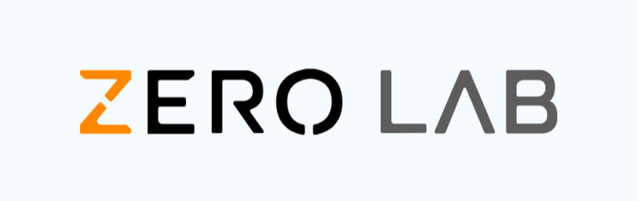

# Zero Lab

<p align="center">
  
</p>

**Zero Lab** is a planned hardware-aware research and engineering platform for AlphaZero, MuZero, and modern tree-search reinforcement learning systems.

## Current Status

The repository is at the early implementation stage. It has project metadata, a minimal CLI, runtime configuration, logging, deterministic Python seeding, toy-game adapters, and a Chess adapter backed by legal move generation.

## Project Shape

*   **Universal Engine**: Game-agnostic architecture for perfect-information domains.
*   **Chess First**: Native environment support from the start, not just a showcase.
*   **MuZero Ready**: Learned-dynamics planning and latent search.
*   **MCTS Core**: Shared search logic with batched neural inference.
*   **Research Pipeline**: Reproducible training, replay, and evaluation loops.
*   **Full Benchmarking**: Measures strength, sample efficiency, and hardware metrics.
*   **Native Path Later**: Memory-sensitive search, replay, batching, and inference plumbing can move to C++ once profiling proves the bottlenecks.
*   **Engineered Docs**: Documentation for maintainers and technical reviewers.

## Quick Start

```bash
python -m pip install -e .[dev]
zero-lab smoke-test
zero-lab list-games
python -m pytest
```

